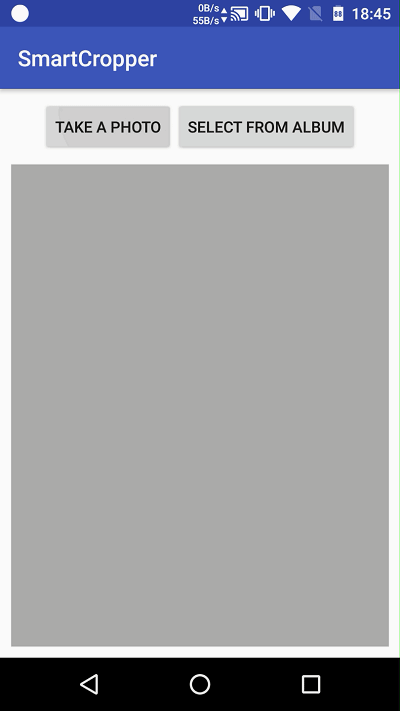

# SmartCropper

## [English](README_EN.md) | 中文

简单易用的智能图片裁剪库，适用于身份证，名片，文档等照片的裁剪。 如果觉得还不错，欢迎 start，fork。

## 支持特性

- 使用智能算法(基于opencv)识别图片中的边框  
- 支持拖动锚点，手动调节选区，放大镜效果提升定位体验
- 使用透视变换裁剪并矫正选区，还原正面图片
- 支持丰富的UI设置，如辅助线，蒙版，锚点，放大镜等

## 例子（[传送门](art/SmartCropperSampleV5.apk)）


### 1. 选择图片后智能选区，使用透视变换裁剪并矫正选区：


### 2. 拖动锚点，手动调节选区，右上角放大镜效果方便拖拽定位：


### gif 动画：




## 接入

可以直接依赖 aar 文件夹下的 aar 文件，也可以 clone 项目，将 smartcropperlib 作为 Android 模块导入。
另外 libs 目录下是编译好的 native library，如果引入项目不想编译，可以直接使用。（JCenter 仓库地址之后提供）

注意：由于使用了 JNI， 请**不要混淆**  

```
-keep class me.pqpo.smartcropperlib.**{*;}
```  

## 使用  

### 1. 裁剪布局：  
```xml
<me.pqpo.smartcropperlib.view.CropImageView   
        android:id="@+id/iv_crop"  
        android:layout_width="match_parent" 
        android:layout_height="match_parent" />  
```  

注意： CropImageView 继承至 ImageView，但是 ScaleType 必须为居中类型，如果手动设置成 fit_end,fit_start,matrix 将会报错。  

### 2. 智能选区：    

```java  
Point[] points = SmartCropper.scan(selectedBitmap);    
```  
在 native 层智能识别边框，返回的 points 是大小为4的数组，表示选区边框的四个顶点，依次为左上，右上，右下，左下。   

注意：如果识别失败将返回一个大小为4，内容均为空的数组。该方法主要在 native 层实现，大大的提高了运行效率，运行时间与图片大小成正比，在大图片的情况下，可以考虑在子线程执行，或者压缩传入的图片。  

### 3. 设置选区顶点

```java
ivCrop.setCropPoints(points);    
```

将上一个步骤返回的选区顶点，设置给 CropImageView 绘制选区。   

注意：必须先设置图片（setImageBitmap(selectedBitmap)）再设置选区顶点，否则选区将失效。如果设置的顶点无效会默认使用包裹整个图片的选区。

### 3. 裁剪选区内的图片：

```java  
Bitmap crop = ivCrop.crop();  
```  
根据选区裁剪出选区内的图片，并使用透视变换矫正成正面图片。  

注意：与 SmartCropper.scan 类似，改方法主要逻辑也是位于 native 层，运行时间与图片大小成正比，在大图片的情况下，可以考虑在子线程执行，或者压缩传入的图片。

## API 说明

### SmartCropper 类：

对外提供统一的图片处理接口，其主要实现位于 native 层。  

#### 1. 扫描边框，大图下会比较耗时，考虑子线程调用。

```java
public static Point[] scan(Bitmap srcBmp)
```   

返回值是大小为4的 Point 数组，表示选区边框的四个顶点，依次为左上，右上，右下，左下。

#### 2. 根据边框顶点裁剪，大图下会比较耗时，考虑子线程调用。

```java
public static Bitmap crop(Bitmap srcBmp, Point[] cropPoints)
```

### CropImageView 类：

继承于 ImageView，用于显示选区，辅助线，放大镜等

#### 1. 设置裁剪边框锚点,必须先设置图片，否者该方法会失效
```java
public void setCropPoints(Point[] cropPoints)  
```  
cropPoints 的大小必须为4，依次为左上，右上，右下，左下。SmartCropper.scan 返回的数组已经排过序。

注意：顶点的坐标是基于设置图片的大小，而非 View 的大小

#### 2. 设置选区外的透明度
```java
public void setMaskAlpha(int mMaskAlpha)
```

#### 3. 设置是否显示辅助线,默认开启
```java
public void setShowGuideLine(boolean showGuideLine)
```
#### 4. 设置选区边框线颜色
```java
public void setLineColor(int lineColor)
```
#### 5. 设置选区边框线宽度

```java
public void setLineWidth(int lineWidth)
```

#### 6. 根据用户选区裁剪图片，大图下会比较耗时，注意在子线程操作

```java
public Bitmap crop()
```

#### 7. 根据指定顶点裁剪图片

```java
public Bitmap crop(Point[] points)
```

#### 8. 设置开启放大镜效果,默认开启
```java
public void setmShowMagnifier(boolean mShowMagnifier)
```  

#### 9. 判断选区是否为凸四边形
```java
 public boolean canRightCrop()
```  

#### 10. 设置选区为全图,必须先设置图片
```java
public void setFullImgCrop()
```  


## Features

- [x] 优化点排序算法
- [x] CropImageView 选区放大镜效果
- [ ] 优化智能选区算法
- [ ] CropImageView xml属性配置
- [ ] 欢迎提 ISSUE

---

## 关于我：

- 邮箱：    pqponet@gmail.com
- GitHub：  [pqpo](https://github.com/pqpo)
- 博客：    [pqpo's notes](https://pqpo.me)
- Twitter: [Pqponet](https://twitter.com/Pqponet)
- 微信公众号: pqpo_me(扫下方二维码) 


License
-------

    Copyright 2017 pqpo

    Licensed under the Apache License, Version 2.0 (the "License");
    you may not use this file except in compliance with the License.
    You may obtain a copy of the License at

       http://www.apache.org/licenses/LICENSE-2.0

    Unless required by applicable law or agreed to in writing, software
    distributed under the License is distributed on an "AS IS" BASIS,
    WITHOUT WARRANTIES OR CONDITIONS OF ANY KIND, either express or implied.
    See the License for the specific language governing permissions and
    limitations under the License.


